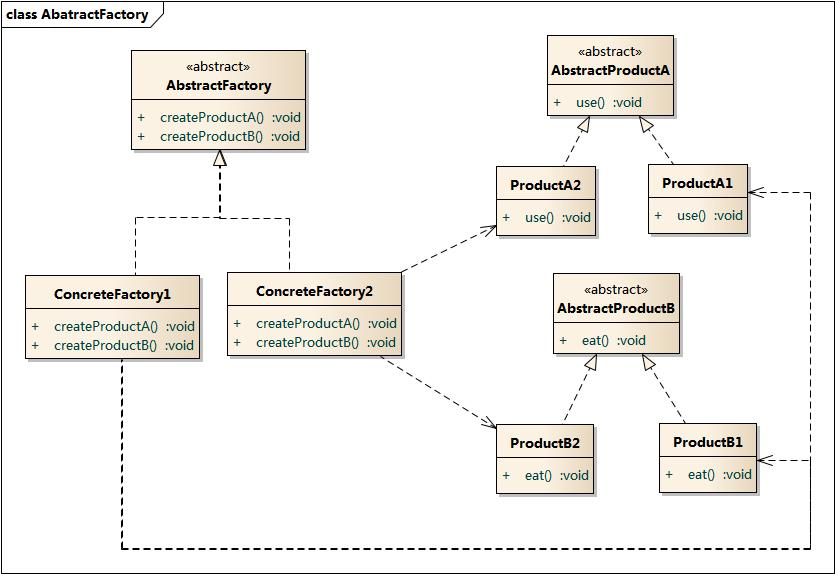

# 设计模式

## 一、面对对象设计原则

##### 1.封装变化

找出应用中可能需要变换之处，把它们独立出来，不要和那些不需要变化的代码混合在一起

##### 2.针对接口编程而不是针对实现编程

##### 3.多用组合，少用继承

##### 4.开放封闭原则

类的设计应该对扩展开放，对更改封闭。但类模块应该是不可修改的

##### 5.尽可能让交互对象之间保持松耦合

##### 6.依赖倒置原则

要依赖抽象，而不要依赖具体类

##### 7.最少知识原则

尽量减少对象之间的交互，以减少对别的类的依赖

##### 8.好莱坞原则

不要让高层组件依赖底层组件

##### 9.单一职责原则

一个类应该仅有一个引起变化的原因

##### 10.里氏替换原则

派生类和基类属于同一种（is-a）关系，则派生类应该能够替换

##### 11.接口隔离原则

不应该强迫客户程序依赖它们不用的方法，接口应该小而完备

## 二、行为型模式

行为型模式涉及到类和对象如何**交互以及职责的分配**，除了观察者模式之外这些模式都基本上倾向于将一个对象进行封装并把某些责任的实现/完成以封装的形式委托给封装的对象（或者说是指针/引用指向的对象）

##### 1.策略模式

> 定义一个算法族，分别封装起来，让它们可以相互替换，此模式让算法的变化独立于使用算法的客户

##### 2.观察者模式

> 定义对象之间的一对多依赖关系，这样一来，当一个对象（被观察者）改变状态时，它的所有依赖者（观察者）都会收到通知并自动更新

##### 3.命令模式

> 将“请求”封装成命令对象，以便使用不同的请求、队列或日志来参数化其他对象。命令模式还可以支持撤销等操作。命令模式的目的是将发出请求的对象与执行请求的对象解耦合

##### 4.模板方法

> 在一个方法中定义一个算法的骨架，而将一些步骤延迟到子类中。模板方法使得子类可以在不改变算法的结构的情况下，重新定义算法中的步骤

##### 5.迭代器模式

>提供一种方法顺序访问一个聚合对象中的各个元素，而又不暴露其内部的表示

##### 6.状态模式

> 允许对象在内部状态改变时改变它的行为，对象看起来好像修改了它的类一般。该模式将状态封装称为独立的类，并将动作委托到代表当前状态的对象，类的行为随着内部状态的改变而改变

##### 7.责任链模式

> 为某些请求创建一个对象链，每一个对象链依序检查这些请求，并对哪些满足自身规定的请求进行处理，或者将它传送给下一个对象

##### 8.解释器模式

##### 9.中介者模式

> 用一个中介对象来封装一系列的对象交互，中介者使个对象不需要显式地相互引用，从而使达到松耦合的目的，而且可以独立的改变它们之间的交互

##### 10.备忘录模式

##### 11.访问者模式

## 三、结构型模式

将类或对象**组合到**一个更大的结构中，这些模式都有一个特点那就是将一个对象组合进另一个对象之中（这种组合可能是以引用或者指针指向的方式来实际实现）

##### 1.装饰模式

> 动态地将责任附加到对象上。若要扩展功能，装饰者提供了比继承更有弹性地替代方案

##### 2.适配器模式

> 将一个类的接口转换成客户期望的另一个接口，适配器又分为类适配器和对象适配器，其中类适配器需要有多继承的支持

#####  3.外观模式

> 提供一个统一的接口用来访问子系统中一群接口，外观定义了一个高层接口让子系统更容易使用

##### 4.组合模式

> 允许将对象组合成树形结构来表现“整体/部分”层次结构。组合能让客户以一致的方式处理个别对象以及对象组合

##### 5.组合迭代器模式

> 这种模式可以认为是作用于组合模式之上的迭代器模式，这种迭代器提供了遍历组合模式形成的组件对象树上每一个成员迭代器的能力

##### 6.代理模式

> 代理模式使用代表对象控制对某对象的访问，被代理的对象可以是远程对象，也可以是创建开销大的对象或者是需要安全控制的对象。代理对象是由用户自己创建还是由代理对象去创建需要处于自身考量

###### 6.1.保护代理模式

> 根据访问权限决定客户是否可以访问对象的代理模式

##### 7.桥接模式

> 将实现和抽象放在两个不同的类层次中而使它们可以独立改变。类似于effective C++中将的句柄类（handler class）的设计方法

##### 8.享元模式

> 运用共享共享技术有效地支持大量细颗粒度对象的复用。系统只是用少量的对象，而这些对象又都非常相似，状态变化很小，可以实现对象的对此复用。例如每一个对象真正用到的数据放在享元工厂类对象中的容器中，而小对象的控制逻辑放在对象自己之中实现

## 四、创建型模式

涉及到对象的实例化，它将客户从所需要实例化的对象中解耦合

##### 1.简单工厂模式

> 在C++上就是用if-elseif-else组成的静态函数，可以返回一族产品的抽象基类。本质上它不是一种设计模式

##### 2.工厂方法模式

> 超类负责提供一个创建对象的接口，但是由派生的子类来负责真正具体对象的创建

##### 3.抽象工厂模式

> 超类提供一组产品家族对象创建的接口，而子类中的方法负责真正的创建每一个接口的实现。在实现抽象工厂模式的过程中一般会用到工厂方法模式来完成具体对象的创建。可以认为抽象工厂模式是工厂方法模式的集合抽象

##### 4.单例模式

> 确保一个类只有一个实例，并提供全局全局访问访问点

##### 5.构造者模式

> 封装一个产品的构造过程，并允许按照客户自定义的步骤进行构造

##### 6.原型模式

## 五、复合模式

##### 1.MVC模式

> mvc是一种结合了观察者模式、策略模式和组合模式的一种复合模式，常常使用在GUI编程领域

## 六、参考资料

1.[图说设计模式](https://design-patterns.readthedocs.io/zh_CN/latest/index.html)

2.[计算机图书推荐，尽量支持正版书籍！提取码：7khd](https://pan.baidu.com/s/19rcdcu5AMnPeoTM5DZmseQ)

