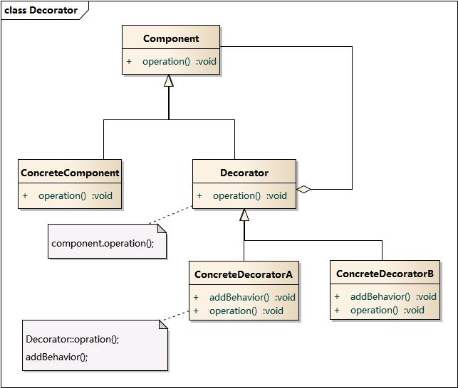

# 设计模式

#### 行为型模式

###### 1.策略模式

> 定义一个算法族，分别封装起来，让它们可以相互替换，此模式让算法的变化独立于使用算法的客户

###### 2.观察者模式

> 定义对象之间的一对多依赖关系，这样一来，当一个对象改变状态时，它的所有依赖者都会收到通知并自动更新

###### 3.命令模式

> 将“请求”封装成命令对象，以便使用不同的请求、队列或日志来参数化其他对象。命令模式还可以支持撤销等操作。命令模式的目的是将发出请求的对象与执行请求的对象解耦合

###### 4.模板方法

> 在一个方法中定义一个算法的骨架，而将一些步骤延迟到子类中。模板方法使得子类可以在不改变算法的结构的情况下，重新定义算法中的步骤

###### 5.迭代器模式

>提供一种方法顺序访问一个聚合对象中的各个元素，而又不暴露其内部的表示

#### 结构型模式

###### 1.装饰模式

> 动态地将责任附加到对象上。若要扩展功能，装饰者提供了比继承更有弹性地替代方案

###### 2.适配器模式

> 将一个类的接口转换成客户期望的另一个接口，适配器又分为类适配器和对象适配器，其中类适配器需要有多继承的支持

######  3.外观模式

> 提供一个统一的接口用来访问子系统中一群接口，外观定义了一个高层接口让子系统更容易使用

###### 4.组合模式

> 允许将对象组合成树形结构来表现“整体/部分”层次结构。组合能让客户以一致的方式处理个别对象以及对象组合

###### 5.组合迭代器模式

> 这种模式可以认为是作用于组合模式之上的迭代器模式，这种迭代器提供了遍历组合模式形成的组件对象树上每一个成员迭代器的能力

#### 创建型模式

###### 1.简单工厂模式

> 在C++上就是用if-elseif-else组成的静态函数，可以返回一族产品的抽象基类。本质上它不是一种设计模式

###### 2.工厂方法模式

> 超类负责提供一个创建对象的接口，但是由派生的子类来负责真正具体对象的创建

###### 3.抽象工厂模式

> 超类提供一组产品家族对象创建的接口，而子类中的方法负责真正的创建每一个接口的实现。在实现抽象工厂模式的过程中一般会用到工厂方法模式来完成具体对象的创建。可以认为抽象工厂模式是工厂方法模式的集合抽象

###### 4.单例模式

> 确保一个类只有一个实例，并提供全局全局访问访问点

#### 参考资料

[1]: https://design-patterns.readthedocs.io/zh_CN/latest/index.html	"图说设计模式"

